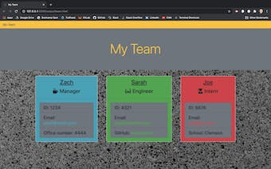
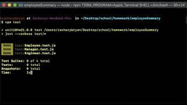

# Employee Summary

[Github link](https://github.com/zacharybryan/employeeSummary)

---
## Description

Drescribe project here

---
### Table of Contents

* [Description](#description)
* [Installation](#installation)
* [Usage](#usage)
* [Contributing](#contributing)
* [Tests](#tests)
* [Questions](#questions)
* [License](#licence)

---
### Installation

* Install Node.js if not currently installed on device [Node.j](https://nodejs.org/en/download/)
* [Get clone from github](https://github.com/zacharybryan/employeeSummary)
* Run git clone git@github.com:zacharybryan/employeeSummary.git from the command line
* Run npm install from command line in employeeSummary file
* To Start run node app.js in the command line

[Watch the demo here!](./assets/demo.mp4)
steps here

---
### Usage

Watch the video below

---
### Contributing

[Plover Brown](https://www.github.com/rebgrasshopper)

---
### Tests

Watch the video below

---
### Questions

For any additional questions or update requests please contact me at zacharybryan@icloud.com

Find some of my other projects here!
[zacharybryan](https://www.github.com/zacharybryan)

---
### License

GNU General Public License v3.0

---
Copyright (c) 2020 Zachary Bryan
